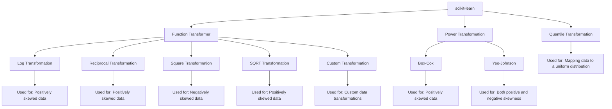

#  Data  Transformer

 

It is a feature transformation technique. Generally, transformer are used to convert the data into a normal like distribution. We use transformer so that data will better meet the assumptions of a particular ML algorithm or we can say to make the data more suitable for modeling

Here is a simple flow chart:

---

### Log Transformation

**Information**: Applies the natural logarithm to the data. This transformation is useful for data that is highly skewed, as it can help stabilize the variance and make the data more normally distributed. 
**Use Case**: Positive data values, particularly when data spans several orders of magnitude.

### Reciprocal Transformation

**Information**: Transforms the data by taking the reciprocal (1/x) of each value. This can be helpful for reducing the impact of large values. 
**Use Case**: Positive data values, useful when you want to compress large values and expand small values.

### Square Transformation

**Information**: Applies the square of the data values, which can help manage negative skewness and reduce the impact of smaller values. 
**Use Case**: Negative data values, commonly used when the data has a distribution that is negatively skewed.

### SQRT Transformation

**Information**: Applies the square root to the data, which can help stabilize variance and make the distribution more symmetric.
 **Use Case**: Positive data values, commonly used when the data has a Poisson distribution.

### Custom Transformation

**Information**: Allows the application of user-defined transformations to the data. 

    trf = FunctionTransformer(func=np.log1p)

**Use Case**: Any data where specific, tailored transformations are needed that aren't covered by standard functions.

### Power Transformation

**Information**: Includes Box-Cox and Yeo-Johnson transformations to stabilize variance and make the data more Gaussian-like.
 **Use Case**:
 
-   **Box-Cox**: Positive data values only. n > 0 
    
    $$
        x_ i^ \lambda = 
        \begin{cases} 
        \frac{x_i^\lambda - 1}{\lambda}, & \text{if } \lambda \neq 0, \\
        \ln (x_i), & \text{if } \lambda = 0,
        \end{cases}
    $$

     The exponent here is a variable called lambda (X) that varies over the range of **-5 to 5** and in the process of searching, we examine all values of X. Finally, we choose the optimal value (resulting in the best approximation to a normal distribution) for your variable.

-   **Yeo-Johnson**: Can handle **both positive and negative** data values.

    $$   x_ i^ \lambda =
        \begin{cases} 
        \frac{(x_i + 1)^\lambda - 1}{\lambda}, & \text{if } x_i \geq 0 \text{ and } \lambda \neq 0, \\ \\
        \ln(x_ i + 1), & \text{if } x_i \geq 0 \text{ and } \lambda = 0, \\ \\
        -\frac{-(x_i + 1)^{2 - \lambda} - 1}{2 - \lambda}, & \text{if } x_i < 0 \text{ and } \lambda \neq 2, \\ \\
        -\ln(- x_i + 1), & \text{if } x_i < 0 \text{ and } \lambda = 2,
        \end{cases} 
    $$   
    
    
    This transformation is somewhat of an adjustment to the Box-Cox transformation, by which we can apply it to negative numbers.

### Quantile Transformation

**Information**: Maps data to a uniform or normal distribution based on quantiles, effectively reducing the impact of outliers. **Use Case**: Any data distribution, especially when aiming for a specific target distribution like uniform or Gaussian.

---

