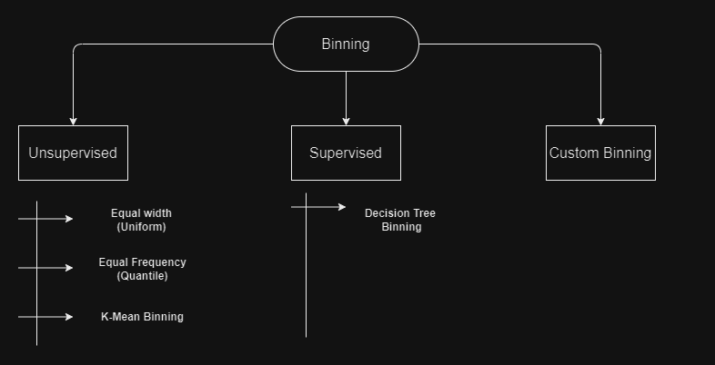

# Encoding Numerical Features

 

## Discretization
Discretization is the process of transforming continuous variables into discrete variables by creating a set of contiguous intervals that span the range of the variable's values. Discretization is also called binning & where bin is an alternative
name for interval.

### Why use Discretization:
 - To handle Outliers
 - To improve the value spread

-   **Unsupervised Binning**:
    
    -   **Equal Width (Uniform)**: Divides the range of data into intervals of equal size. This method does not consider the data distribution.
    -   **Equal Frequency (Quantile)**: Each bin contains an approximately equal number of data points. This method ensures that each bin has the same number of elements.
    -   **K-Mean Binning**: Uses the K-means clustering algorithm to create bins. Data points are grouped into clusters, which are then used as bins.
-   **Supervised Binning**:
    
    -   **Decision Tree Binning**: Uses a decision tree algorithm to create bins based on the target variable. This method considers the relationship between the feature and the target variable to determine the binning.
-   **Custom Binning**: Allows the user to define their own bin edges based on domain knowledge or specific criteria, offering complete control over the binning process.

## Binarization

Binarization is a data preprocessing technique that transforms continuous data or categorical data with multiple levels into binary values (0 or 1). Here's a brief explanation:

-  **Thresholding**:
    
    -   **Simple Thresholding**: Converts values above a certain threshold to 1 and values below the threshold to 0. This is often used for continuous data.
- **One-Hot Encoding**:
    
    -   **Categorical Binarization**: Converts categorical data into a series of binary variables, each representing a category. For example, a categorical feature with three categories (A, B, C) would be transformed into three binary features.
-  **Binary Encoding**:
    
    -   **Label Binarization**: Converts multi-class labels into binary form for use in certain algorithms, especially in the context of machine learning and neural networks.

